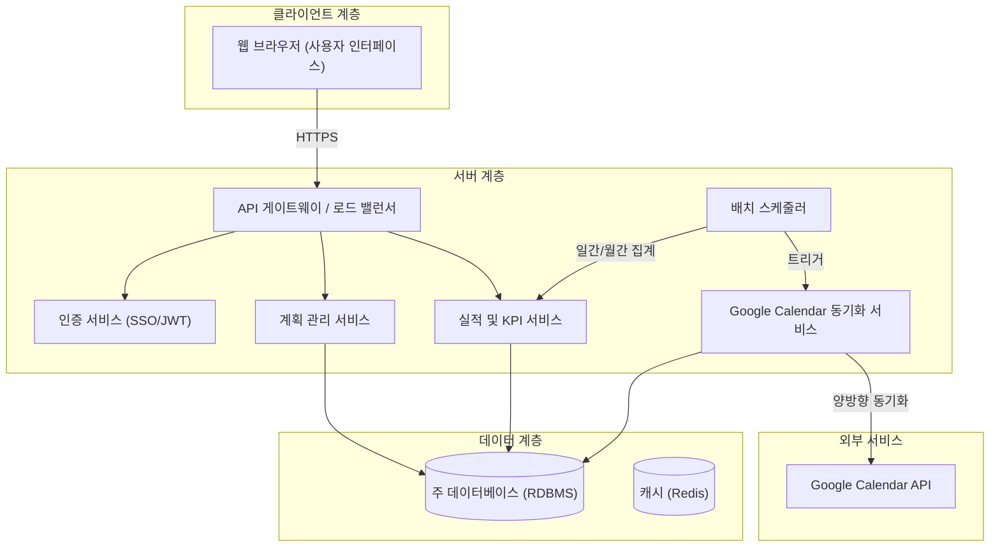
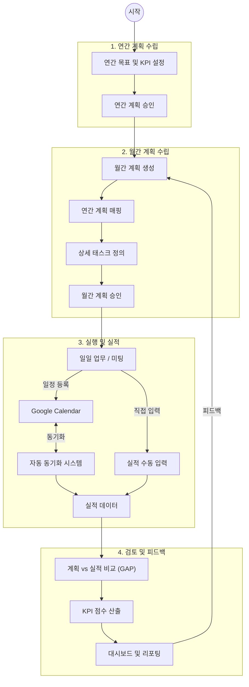

# ERP 시스템 아키텍처 및 프로세스 다이어그램

`erp_plan.md`를 기반으로 한 전체 시스템 아키텍처와 핵심 프로세스 흐름도입니다.

## 1. 전체 시스템 아키텍처

시스템은 사용자(Web), ERP 코어 서버, 데이터베이스, 그리고 외부 서비스(Google Calendar)로 구성됩니다.

## 2. 핵심 프로세스 흐름

연간 계획 수립부터 월간 계획 상세화, 실행(Google Calendar 연동), 그리고 실적 분석 및 피드백까지의 흐름입니다.

## 3. 데이터 흐름 개요

1.  **계획**: 연간 계획이 월간 계획으로 구체화됩니다.
2.  **실행**: 사용자가 업무를 수행합니다. 미팅은 Google Calendar에서 관리됩니다.
3.  **동기화**: 시스템이 Google Calendar와 동기화하여 미팅 기록을 '실적'으로 가져옵니다.
4.  **분석**: 시스템이 '월간 계획'과 '실적'을 비교하여 KPI를 계산하고 대시보드에 표시합니다.
